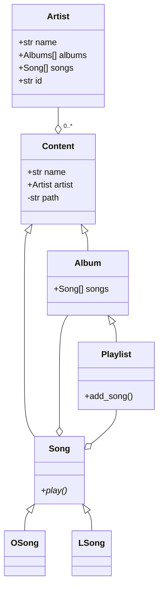
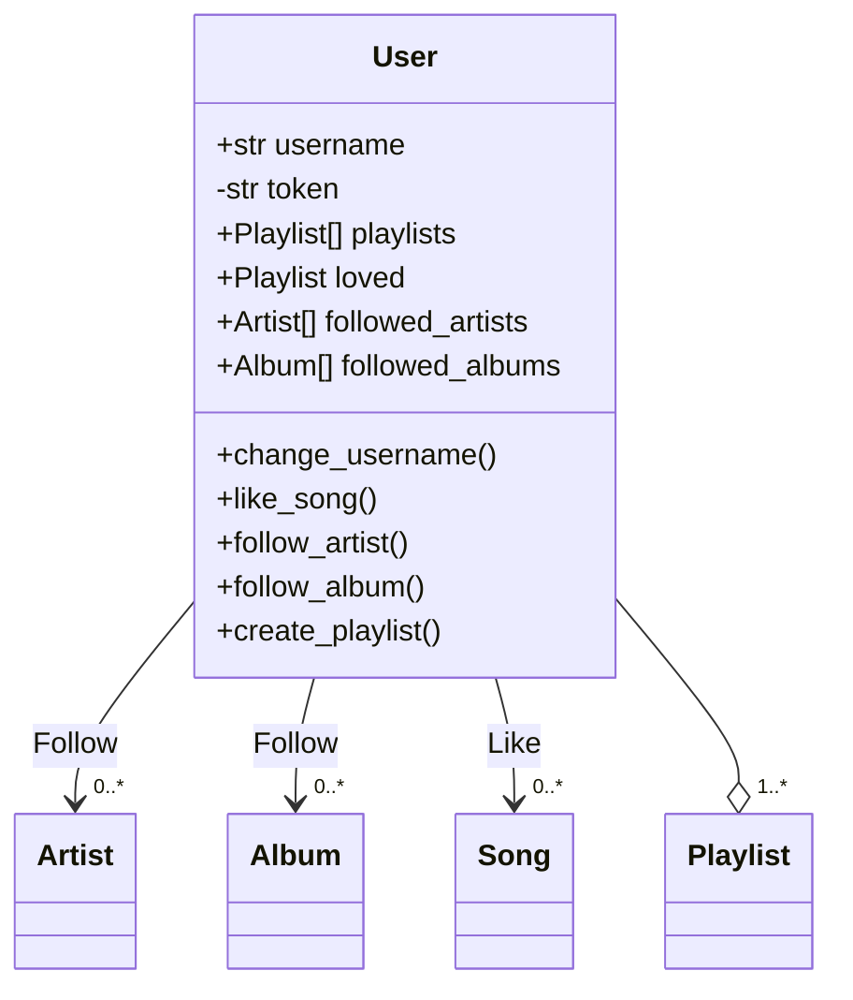

```mermaid
classDiagram
class Content {
    +str name
    +Artist artist
    -str path
}
Artist --o "0..*" Content
Content <|-- Album
Content <|-- Song
class Album {
    +Song[] songs
}
Album <|-- Playlist
class Playlist {
    +add_song()
}
class Song {
    +play()*
}
class OSong
class LSong
Song <|-- OSong
Song <|-- LSong
Album --o Song
Playlist --o Song
class Artist {
    +str      name
    +Albums[] albums
    +Song[]   songs
    +str      id
}
```

```mermaid
classDiagram
class User {
    +str        username
    -str        token
    +Playlist[] playlists
    +Playlist   loved
    +Artist[]   followed_artists
    +Album[]    followed_albums
    +change_username()
    +like_song()
    +follow_artist()
    +follow_album()
    +create_playlist()
}
User --> "0..*" Artist : Follow
User --> "0..*" Album  : Follow
User --> "0..*" Song   : Like
User --o "1..*" Playlist
```
